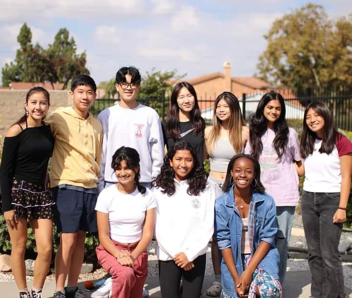

<body style="background-color:lightblue;">
<h3>Junior Optimist International is a world-wide organization that focuses on helping communities around the world, and through Whitney, we focus on serving our community in any way we can!
</h3>

  

    <h1>Who Are We?</h1> 
     
JOI is an organization within our school that works to teach students of leadership within their community, through service events, and other academic opportunities, and help serve our community to make it a better place.
<a href="https://www.cerritosoptimistclub.com/">Cerritos Optimist Club</a> is another organization that we assimilate with through events, and we work together to provide a cared space for our community.

 

   <h1>Special Events</h1>
   
We work with our local schools around the area to particpate in volunteerings (one of our most famous is Trunk-Or-Treat), as well as we participate in many academic scholarships and contests year round.

   

  <h1> Sign-Ups</h1>
  <a href="https://docs.google.com/forms/d/e/1FAIpQLSdT8zRrkKkdEWZG6itjukJFplPk548az9RMjtkHERDC-XYiyA/viewform">Trunk-Or-Treat</a>
